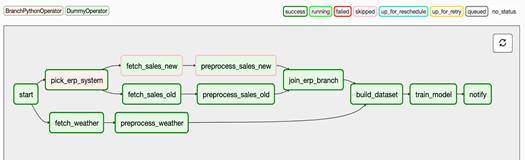

# Branches, dependencies

##### Linear dependencies
`task1` >> `task2`: if task1 completed succesfully task2 can be started

`task1` >> `[task2, task3]` >> `task4`: if task1 completed successfully then task2, task3 can be started, they will run paralelly. If task2 and task3 finished succesfully task4 can be started.

##### Branches
 Callable passed to the `BranchPythonOperator` are expected to return the ID of a downstream task as a result of their computation. The returned ID determines which of the downstream task will be executed after completion of the branch task.
```python
def _pick_erp_system(**context):
  if context["execution_date"] < ERP_SWITCH_DATE:
    return "fetch_sales_old"
  else:
    return "fetch_sales_new"

chooser_branch = BranchPythonOperator(
  task_id='chooser_branch',
  provide_context=True,
  python_callable=_pick_erp_system,
)
```
The dependencies should be defines as follows:<br/>
`chooser_branch` >> `[fetch_sales_old, fetch_sales_new]`

The branches should be merged by a **DummyOperator**. This can be seen below.


Trigger rules are set to `all_success` by default, meaning that all parents of the corresponding task need to succeed before the task can be run. This should be modified for `none_failed`.

```python
from airflow.operators.dummy_operator import DummyOperator

join_branch = DummyOperator(
    task_id="join_erp_branch",
    trigger_rule="none_failed"
)

[preprocess_sales_old, preprocess_sales_new] >> join_branch
```

##### Conditional task
If we want to execute a given task (called **task_cond**) based on some conditions we have to create a new task (called **task_pre**). We should check the condition in this **task_pre**, and add this task as a dependency to the **task_cond**. <br/>
`if_most_recent >> notify`

 If the condition does not met, we should raise an `AirflowSkipException` from our function.

```python
from airflow.exceptions import AirflowSkipException

def _latest_only(**context):
     # Find the boundaries for our execution window.
      left_window = context['dag'].following_schedule(context['execution_date'])
      right_window = context['dag'].following_schedule(left_window)

     # Check if our current time is within the window.
     now = pendulum.utcnow()
      if not left_window < now <= right_window:
           raise AirflowSkipException("Not the most recent run!")
```
