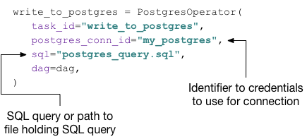

# Complete Airflow Tutorial
This tutorial based on the book **[Data Pipelines with Apache Airflow](https://www.manning.com/books/data-pipelines-with-apache-airflow)**.

## Table of contents


### What is Airflow?
Airflow is a workflow management system. Airflow provides a Python framework to develop data pipelines. It can operate and scale out on multiple machines.<br/> **AIRFLOW IS DESIGNED TO HANDLE BATCH PROCESSING** not for streaming data.

##### Airflows nomenclature

The followings are the most used
- Airflow **DAGs** are composed of **Tasks**
- **Tasks** is created by instantiating an **Operator** class. A configured instance of an Operator becomes a Task
- When a DAG is started, Airflow creates a **DAG Run** entry in its database
- When a Task is executed in the context of a particular DAG Run, then a **Task Instance** is created


##### What is Airflow for?
Airflow ensuring tasks are started in the correct order, sending notifications in case of failure or retry the failed process if desired, monitor the status of tasks, and collect logs of all tasks.

Workflows defined in form of **Directed Acyclic Graphs**. Every rectangle is a `Task`. An example can be seen below.
<br/>

**Dependency terminology using the image above**:
- `branch_a` is **downstream**  of `branching`
- `branching` is an **upstream** of `branch_a`
- arrows indicates the order of execution

##### Airflow components
- webserver => UI  `airflow webserver`
- scheduler => Scheduling tasks `airflow scheduler`
- database  => Storing information `airflow initdb`

##### Backfilling
Backfilling makes possible running workflows back in time. So if there was a change in the logic, it could run on historical data.

<======================================================><br/>
<======================================================>

### DAGs
DAG python files must be located in the **dags** folder by default. It can be overwritten in the config file.
##### Structure of a basic dag
Common includes:
- `import airflow`
- `from airflow import DAG`
- `from airflow.operators.[name] import [name]`

**Steps to create a DAG**<br/>
**1. DAG INSTANCE**<br/>
The DAG is the starting point of any workflow. All tasks within the workflow reference this DAG object so that Airflow knows which tasks belong to which DAG
```python
dag = DAG(
   dag_id="download_rocket_launches",
   start_date=airflow.utils.dates.days_ago(14),
   schedule_interval=None,
)
```

**2. OPERATORS** <br/>
Each operator performs a single unit of work, and multiple operators together form a workflow or DAG in Airflow.

```python
download_launches_task = BashOperator(
   task_id="download_launches",
   bash_command="curl -o /tmp/launches.json 'https://launchlibrary.net/1.4/launch?next=5&mode=verbose'",
   dag=dag,
)
```

**3. DEPENDENCIES** <br/>
Operators run independent of each other, although you can define the order of execution, which we call “dependencies” in Airflow.<br/>

Lets take an example:<br/>
`download_launches_task >> task_two >> task_three` <br/>
This ensures the get_pictures task runs only after download_launches has been completed successfully, and the notify task only runs after get_pictures has completed successfully.


##### Failure
It’s not uncommon for tasks to fail, which could be for a multitude of reasons
###### In case of task failing
Checking the log is a good practice to find the root of an error. It can be done via the UI by clicking on that particular task and selcet view logs.

Assume that one task failed. it would be unnecessary to restart the entire workflow. A nice feature of Airflow is that you can restart from the point of failure and onwards, without having to restart any previously succeeded tasks. To do this click on **CLEAR** button.

<======================================================><br/>
<======================================================>

### Scheduling workflows
Airflow DAGs can be run at regular intervals by defining a scheduled interval for the DAG. Schedule intervals can be defined using the `schedule_interval` argument when initializing the DAG. By default, the value of this argument is `None`, which means that the DAG will not be scheduled and will only be run when triggered manually from the UI or the API.

#### Scheduling using macros
We can use the macro `@daily` for defining a daily scheduled interval which runs our DAG once every day at midnight: <br/>
    `schedule_interval="@daily"`<br/>
Other macros:
- @once
- @daily
- @monthly, etc..

#### Start_date and End_date
For Airflow to know from which date it should start scheduling our DAG runs, we also need to provide a start date for our DAG. `start_date=dt.datetime(year=2020, month=3, day=25)`. <br/>Airflow will schedule the first execution of our DAG to run at `start_date + interval`.<br/> So for example:<br/>
A dag with `start_date` 2020-03-25 and `schedule_interval` **@daily** will run first at 2020-03-06 00:00:00.

It is possible to define until which date our workflow should beeing scheduled. <br/>
`end_date=dt.datetime(year=2020, month=3, day=29),`<br/>
The last run will be in this case **2020-03-29 00:00:00**.

#### Scheduling using cron intervals
It is possible to schedule our workflows using cron notations.
```
┌─── minute (0 - 59)
│ ┌────── hour (0 - 23)
│ │ ┌───── day of the month (1 - 31)
│ │ │ ┌───── month (1 - 12)
│ │ │ │ ┌──── day of the week (0 - 6)
* * * * *
```
Some example:
- `0 * * * *`: hourly
- `0 0 * * *`: daily
- `0 0 * * 0`: weekly
- `0 0 1 * *`: midnight on the first of every month
- `45 23 * * SAT`: 23:45 every Saturday

#### Frequency based intervals
If we want a workflow to run on every third day we can use `timedelta`. <br/>
    `schedule_interval=timedelta(days=3)`

#### Execution_date
Airflow provides parameters that can be used. One of them is `execution_date`, which represents the date and time for which our DAG is being executed. If we have a **start_date=2019-03-03**, then the execution_date will be 2019-03-03.

We can refer to this in code as:<br/>
`{{execution_date}}`<br/>
We can modify the format using the strftime method:<br/>
`{{execution_date.strftime('%Y-%m-%d')}}`
Another way to format is using python syntax:<br/>
`{{ '{:02}'.format(execution_date.hour) }}`

#### What if start_date is in the past?
Airflow will schedule and run any past schedule intervals that have not yet been run, IF `catchup` paramer is set to `true`. <br/>
If it it set to `false` the DAG will only be run for the most recent schedule interval, rather than executing all open past intervals.

<======================================================><br/>
<======================================================>

### Templating
The double curly braces denote a Jinja templated string in the python code. Not all operator arguments are templatable.

#### Template_fields
Every operator can keep a whitelist of attributes that are templatable. This list is set by the attribute `template_fields` on every operator. <br/>
List of these are available on the following link. <br/>
[HERE](https://airflow.readthedocs.io/en/stable/_api/airflow/operators)

#### Variables in the context
The following link contains which variables are available in context of a task.<br/>
[HERE](https://airflow.apache.org/docs/stable/macros.html)


#### Accessing context variables in Python callables
Steps to access context variables:
- set `provide_context` to true
- use the `**context` as paramer to the function

```python
def _print_context(**context):
   print(context["name_of_key"])

print_context = PythonOperator(
   task_id="print_context",
   python_callable=_print_context,
   provide_context=True,
   dag=dag,
)
```
We can directly use the context variables instead of having to extract it from `context` with `context["name_of_key"]`. See the example below: <br/>
```python
def _print_context(execution_date, **context):
	print(execution_date)
	print(context["next_execution_date"])
```
If we do not define explicitly the name of the context variable in the function signature, that variable can be accessed only via **context**.

#### Passing basic parameters to Python callables
- `op_args`: serves as non-keyword parameters
- `op_kwargs`: key-value pairs can be defined

```python
_get_data("/tmp/wikipageviews.gz")
get_data = PythonOperator(
		...
   op_args=["/tmp/wikipageviews.gz"],
	  ...
)
################################################
_get_data(output_path="/tmp/wikipageviews.gz")
get_data = PythonOperator(
		...
   op_kwargs={"output_path": "/tmp/wikipageviews.gz"},
	  ...
)
```
##### Printing out values of templated fields
From the CLI:<br/>
`airflow render [dag id] [task id] [values]`

#### Template_ext
The content of files can also be templated. Each operator can template files with specific extensions by providing the filepath to the operator. <br/>
`template_ext` is the fields, which holds the file extensions that can be templatable by the operator.

##### Search path to templatable files
Jinja requires us to provide the path to search for templatable files. By default only the path of the DAG file is searched for. <br/>
To add more locations to the the default,  `template_searchpath` argument should be used while creating the DAG itself.

<======================================================><br/>
<======================================================>

### Connection to databases
Airflow supports connecting to a wide range of external systems with the help of many operators. To connect to an external system often requires specific dependencies to be installed, which allow connecting and communicating with the external system.<br/>
`pip install apache-airflow[name_of_package]`<br/>
Database operators determine what has to be done, a **hook** determines how to do something. Hooks are doing their own things udner the hood.

**Example**:

- `postgres_conn_id`: is the ID of a given connection, this identifies the database

We can define connection via the user interface in **Admin -> Connections**.


<======================================================><br/>
<======================================================>

### Triggering workflows
So far we have seen how to schedule workflows based on time. Now lets take a look how to trigger workflow based on a specific event happened. For example a file has been uploaded.

#### Sensors
Sensors is a type of operators, which returns true if a certain condition is met, otherwise false. If false, the sensor will wait and try again until either the condition is true, or a timeout is eventually reached.

##### FileSensor
```python
from airflow.contrib.sensors.file_sensor import FileSensor

wait_for_data= FileSensor(
   task_id="wait_for_data
   filepath="/data/data.csv",
)
```
This FileSensor will check for the existence of /data/data.csv and return True if the file exists.
If not, it returns False and the sensor will wait for a given period (default 60 seconds) and try again.<br/> **This sensor should be an upstream of the proper task.**

##### PythonSensor

Another common sensor is `PythonSensor`. <br/>
What if the data comes in multiple files namely data-1.csv, data-2.csv?<br/>
In case of multiple files we make an agreement with the deliver. A file called **_DONE** should indicates that all data files have been uploaded. Now in our workflow we want to check for both the existence of one or more files named data-\*.csv and one file named **_SUCCESS**. <br/>The PythonSensor callable is however limited to returning a boolean value; True to indicate the condition is met successfully, False to indicate it is not.

```python
def _wait_for_data():
   my_path = Path("/data/")
   data_files = my_path.glob("data-*.csv")
   success_file = my_path / "_SUCCESS"
   return data_files and success_file.exists()


wait_for_data = PythonSensor(
   task_id="wait_for_data",
   python_callable=_wait_for_data,
   dag=dag,
)
```

##### Sensor Deadlock
In case of no coming data, sensors accept a timeout argument which holds the maximum number of seconds a sensor is allowed to run for.
If, at the start of the next poke (poke=checking, is the official expression used by airflow), the number of running seconds turns out to be higher than the number set to timeout, the sensor will fail.

By default, the sensor timeout is set to 7 days. If the DAG *schedule_interval* is set to once a day, this will lead to an undesired snowball effect
there’s a limit to the number of tasks Airflow can handle.  There are limits to the maximum number of running tasks on various levels in Airflow:
- **the number of tasks per DAG**,
- **the number of tasks on a global Airflow level**,
- **the number of DAG runs per DAG**, etc

DAG class has a `concurrency` argument which controls how many simultaneously running tasks are allowed within that DAG. Tasks can be occupied all of the slots which
results in a **sensor deadlock**. The Sensor class takes an argument mode, which can be set to either `poke` or `reschedule`. By default it’s set to `poke`, leading to the blocking behaviour.
This means, the sensor task occupies a task slot as long as it’s running. Once in a while it pokes the condition, and then does nothing but still occupies a task slot. <br/>
The sensor `reschedule` mode releases the slot after it has finished poking, so it only occupies the slots while it’s doing actual work.


##### TriggerDagRunOperator

This operator allows triggering other DAGs. The string provided to the `trigger_dag_id` argument of the TriggerDagRunOperator must match the dag_id of the DAG to trigger.

Scheduled DAG runs and task instances have a black border on the UI, while triggered dont. Furthermore, each DAG run holds a field `run_id`. The value of the run_id starts with either:
- **scheduled__** to indicate the DAG run started because of its schedule
- **trig__** to indicate the DAG run started by a TriggerDagRunOperator
- **manual__** to indicate the DAG run started by a manual action (i.e. pressing the “Trigger Dag” button)

###### What about backfilling?
Clearing tasks only clears tasks within the same DAG. So if, say `DAG1` contains a TriggerDAgRunOperator then a new DAG run will be created to the DAG where the main DAG1 points to.

##### ExternalTaskSensor
Using this sensor it is possible to check states of a given task in other DAG.
<br/>
The default behaviour of the ExternalTaskSensor simply checks for a successful state of a task with the **exact same execution date** as itself. So, if an ExternalTaskSensor runs with an execution date of `A`, it would query the Airflow metastore for the given task, also with an execution date of `A`. <br/>
Now let’s say both DAGs have a different schedule interval, then these would not align and thus the ExternalTaskSensor would never find the corresponding task.

##### Triggering from CLI
`airflow trigger_dag dag1 --conf ‘{“supermarket_id”: 1}’`<br/>where
- dag1 is the dag_id
- conf adds additional configuration to the dag, these configuration is available via the **context**


### Custom components

#### Custom Hooks
Trying to get data from an external API, it is a good practice to define a custom hook.

**1.** All hooks are created as subclasses of the abstract BaseHook class
```python
from airflow.hooks.base_hook import BaseHook

class CustomHook(BaseHook):
   ...
```

**2.** The `init` method specifies which connection the hook uses and any other extra arguments that our hook might need in the future.
```python
from airflow.hooks.base_hook import BaseHook

class CustomHook(BaseHook):
   def __init__(self, conn_id):
     super().__init__(source=None)
     self._conn_id = conn_id
```

**3.** Airflow hooks are expected to define a `get_conn` method, which is responsible for setting up a connection to an external system.

External connections with the proper credentials can be defined via the UI. Using the base class `self.get_connection(self._conn_id)` method we can retrieve the connection details for a given connection ID from the metastore.

**A GOOD PRACTICE is caching our session in the instance as member variables.** It helps to avoid recreating the connection every time when we call the `get_conn` method. It is easily doable using an `if` statment.
```python
def get_conn(self):
       if self._session is None:
         ###CREATE THE SESSION
       return self_session
```

**4.** Any functionality can be implemented as one method of the Hook class.

**5.** To use later this hook we should save it somewhere inside our dag folder. <br/>For example if we save it to `dags/myHooks/customHook.py` we can use it from code as `from custom.myHooks import customHook`.

**6.** **USING HOOKS IN CODE ALWAYS REQUIRES CLOSING THE HOOK. THIS CAN BE DONE VIA `hookName.close()`**.

#### Custom Operators
In Airflow, all operators are built as subclasses of the BaseOperator class. Specific params to our operator can be specified explicitly in the `__init__`.  <br/>
To ensure that these default arguments are applied to our custom operator, Airflow supplies the **apply_defaults** decorator, which is applied to the `__init__` method of your operator.

```python
from airflow.models import BaseOperator
from airflow.utils import apply_defaults

class MyCustomOperator(BaseOperator):
   @apply_defaults
   def __init__(self, myParam, **kwargs):
       super.__init__(self, **kwargs)
       self._myParam = myParam
       ...
```

The behaviour of the operator is defined using the execute method, which is the main method that Airflow calls when the operator is actually being executed as part of a DAG run.
```python
class MyCustomOperator(BaseOperator):
   ...
   def execute(self, context):
       ...
```
The function parameter `context` is a dict contains all the Airflow context variables.

##### Make fields of operator templatable
Outside of the constructor just write.
```python
class MovielensFetchRatingsOperator(BaseOperator):
   ...
   template_fields = ("_fieldFirst", "_fieldTwo")
```
