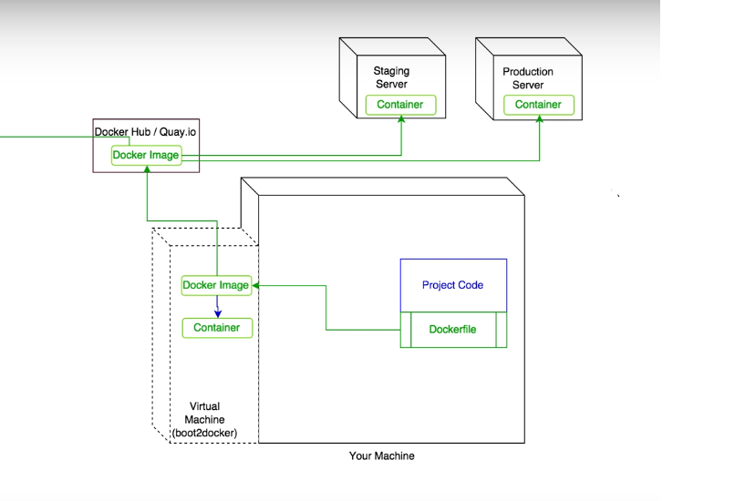
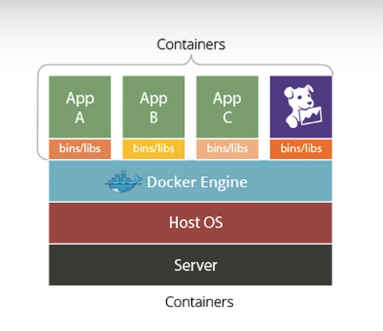

# Docker basics

#### Architecture

 
 
All docker containers use the resources of the host computer.
 

#### Commands to run/start/stop
- `docker login`: login to DockerHUB */dockerhub is the default but it can be changed/*
- `docker images`: lists out images from your local filesystem
- `docker run [image]`: creates a container from the image and starts the container
- `docker run --name [image]`: creates a container from the image and start the container with the given name
- `docker start [name|id]`: it starts a currently not running container
- `docker stop [name|id]`: it stops the container
- `docker ps`: lists out running containers
- `docker ps -a`: lists out running and also not running containers
- `docker rm [name|id]`: remove the container
- `docker run -p 8080:80 [image]`: if docker container use a given port we should expose that, in this example we expose dockers port 80 to our server port 8080
- `docker run -d [image]`: creates a container from the image and starts the container in the background
- `docker run -p 8080:80 -v /home/users/src:/var/www/html`: it mounts a local folder to the container

#### Builds related things
- `docker build -t this_will_be_the_name_of_image location_of_docker_file`: builds our image

### Dangling images
If we build an image with the same name, the older one losts his tag. Its called a **dangling** image. 
To list out dangling images and delete:
- `docker images --filter "dangling=True"`
- `docker rimi $(docker images -q --filter "dangling=True")`
